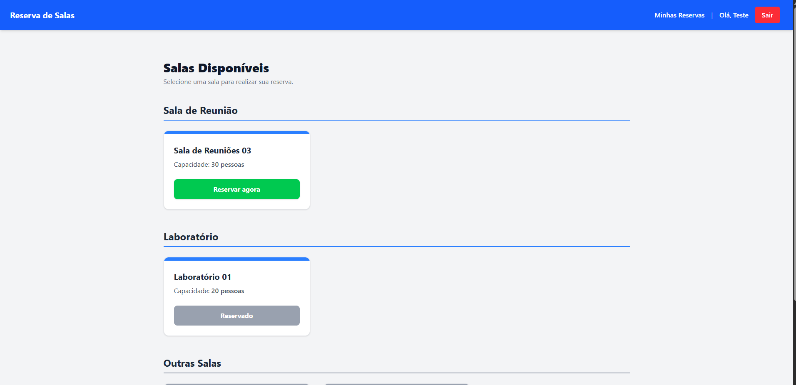
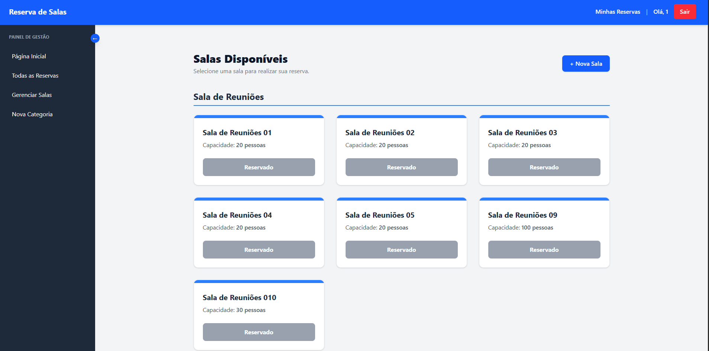
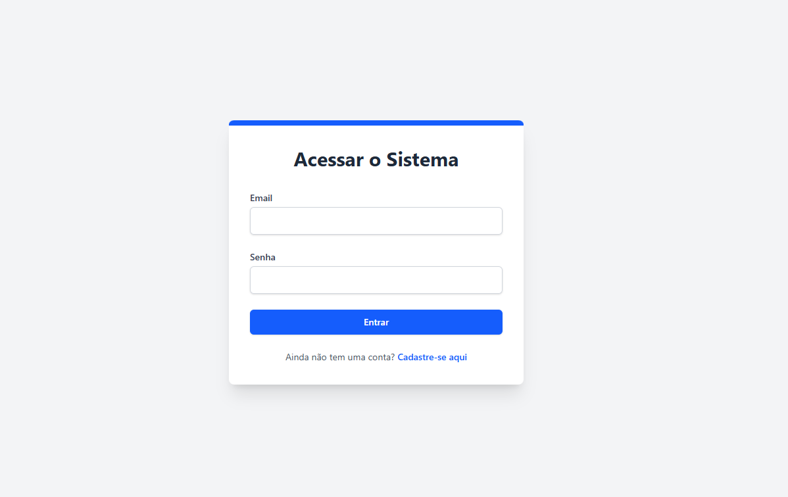
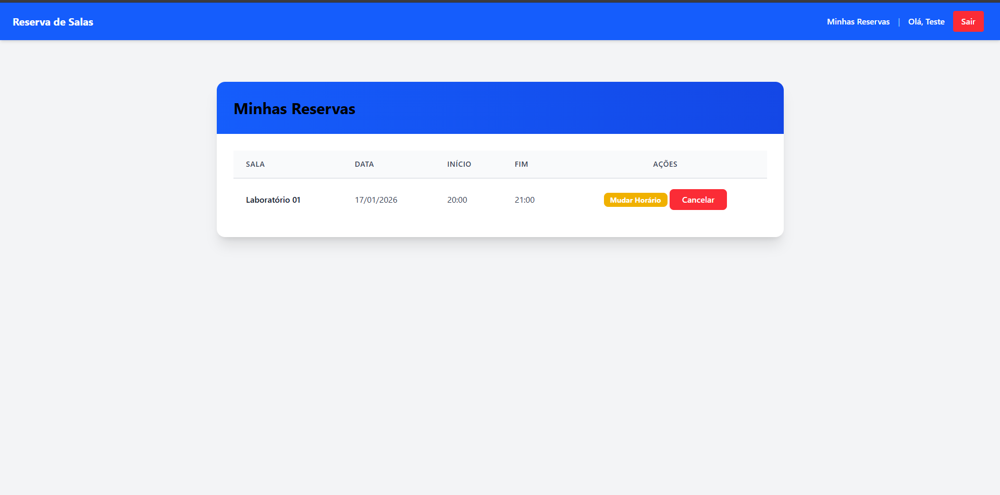

# 🏢 Sistema de Reserva de Salas


Um sistema completo para gestão e reserva de espaços físicos, desenvolvido com **Django** e **Tailwind CSS**. O projeto conta com fluxos distintos para usuários comuns (reserva) e administradores (gestão completa via dashboard).

## 🚀 Funcionalidades

### 👤 Para Usuários
* **Autenticação Segura:** Cadastro e login utilizando e-mail como identificador principal.
* **Reserva de Salas:** Visualização de salas disponíveis e agendamento por data/horário.
* **Meus Agendamentos:** Painel para consultar, editar horários ou cancelar reservas.

### 🛡️ Para Administradores (Staff)
* **Dashboard de Gestão:** Sidebar exclusiva para navegação rápida.
* **Gerenciamento de Salas:** Cadastro de novas salas com capacidade e localização (interface personalizada fora do Django Admin).
* **Categorização:** Criação e gestão de categorias (ex: Auditório, Laboratório).
* **Controle de Ocupação:** Visualização global de todas as reservas ativas e usuários responsáveis.

---

## 📸 Demonstração do Projeto


| Página Inicial (Home) | Dashboard do Admin |
| :---: | :---: |
|  |  |
| *Visualização das salas disponíveis* | *Sidebar e controle de gestão* |

| Autenticação | Gestão de Reservas |
| :---: | :---: |
|  |  |
| *Login limpo com Tailwind* | *Edição e cancelamento de reservas* |

---

## Diagrama ER


---

## 🛠️ Tecnologias Utilizadas

* **Backend:** Python 3.13.9, Django 6.0.1
* **Frontend:** HTML5, Django Templates, Tailwind CSS (via `django-tailwind`)
* **Banco de Dados:** SQLite (Padrão de desenvolvimento)
* **Autenticação:** Custom User Model (E-mail based)

---

## ⚙️ Como Rodar o Projeto Localmente

Siga os passos abaixo para executar o sistema em sua máquina:

### 1. Clone o repositório
```bash
git clone https://github.com/FabricyoSilva/reserva_salas.git
cd reserva_salas
```

### 2. Crie e ative o ambiente virtual
````bash
# Windows
python -m venv venv
.\venv\Scripts\activate

# Linux/Mac
python3 -m venv venv
source venv/bin/activate
`````


### 3. Instale as dependências
```bash
pip install -r requirements.txt
```

### 4. Configure o Banco de Dados

```bash
python manage.py makemigrations
python manage.py migrate
```

### 5. Execute o Servidor
```bash
python manage.py runserver
```

Acesse no seu navegador: http://127.0.0.1:8000/

---

## 📂 Estrutura do Projeto

* `reservas/`: App principal contendo toda a lógica de negócios (Salas, Reservas, Categorias).
* `core/`: Configurações globais do projeto Django (`settings.py`, `urls.py`).
* `theme/`: App de configuração do **Tailwind CSS**.
* `templates/`: Arquivos HTML globais (como `base.html`, `navbar.html`) e templates de autenticação (`registration/`).
